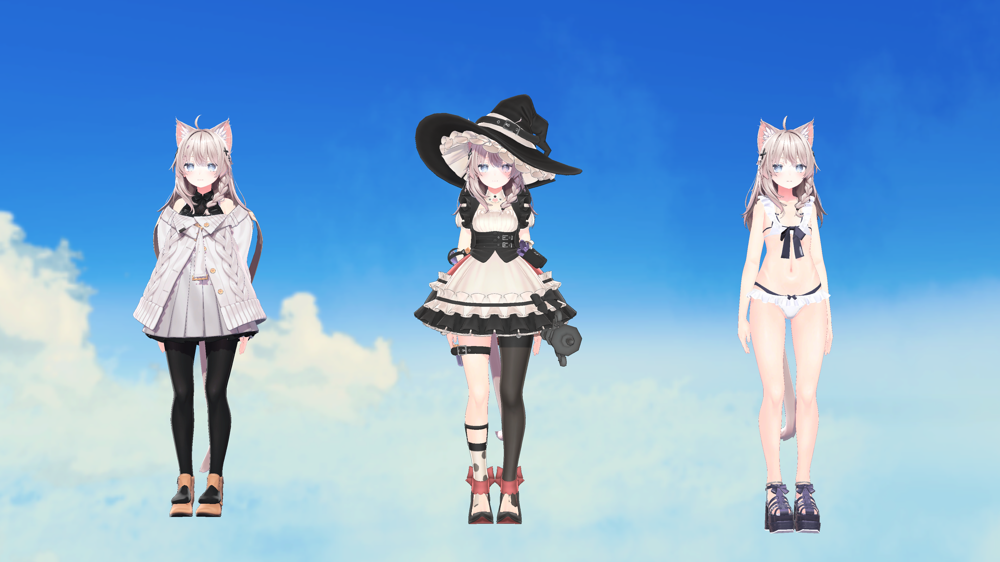
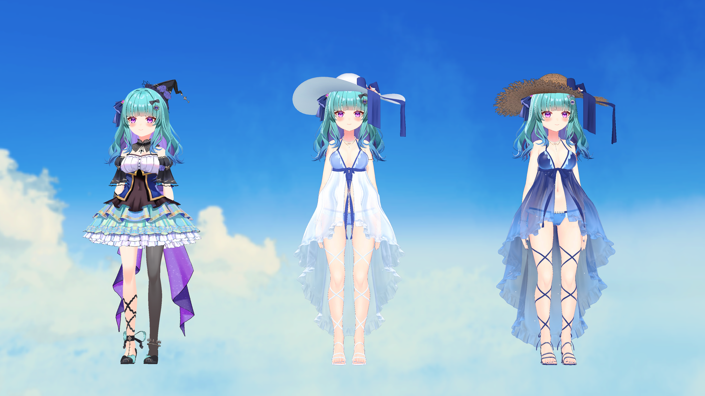

## Description

Modify your existing VRM model by creating a hybrid model with a base model that supports Modular Avatar. This allows your model to support various Booth outfits that support Modular Avatar (for Shinano). The outfitted model is provided as a Warudo Character Mod only.

 

### Includes
* Warudo Character Mod with new outfit
* Replace VRM shaders with Liltoon shaders
* Fix any broken physics during conversion
* Adjust positions of bones to fit model, e.g. hat positions

### Important
* The modular avatar prefab cannot easily be transferred and requires a Unity editor with modified packages, so it will not be provided to the user
* Please note that changes to the model only apply to the final deliverable and will only work in Warudo

### Pricing
* Price: ${}

### Add-ons/Complexity fees
* This service includes one modular avatar outfit for your model. Additional outfits will cost a $20 fee per outfit and the cost of purchasing the outfit.
* If you require both a BIRP and URP character, this will incur a 50% fee

### Requirements

* You must specify if the character is to be used for Warudo or Warudo Pro
* You must ask for a quote and understand that requests may be rejected
* You must have agreed to the ToS for the base model (Shinano) and any outfits
* You must pay 50% upfront before work may begin

### Details
* Estimated to take 1 week
* No work will be performed until first payment
* Delivered as a Warudo Character mod file
    * No VRM or UnityPackage file will be provided
* Physics will be tested using generic test animations
    * You may also provide mocap data to test the character physics against
* Shading will be tested against various Warudo Workshop environments using environment lighting and post-processing
    * You may also specify environments or provide a scene to test against

## Terms of Service

Feel free to use the commissioned character for commercial and personal uses.
You may also transfer the assets to whomever you like.

You are expected to respect the ToS of any assets you are using.

I cannot guarantee that Warudo will always be compatible or functional with the provided character. Updates will require an additional commission.

I cannot guarantee that the character will be completely free of bugs, but I will do my best to fix any bugs you encounter.

Please contact me on X to request a quote or if you encounter any issues.

Refunds are generally not available once production has started or finished.