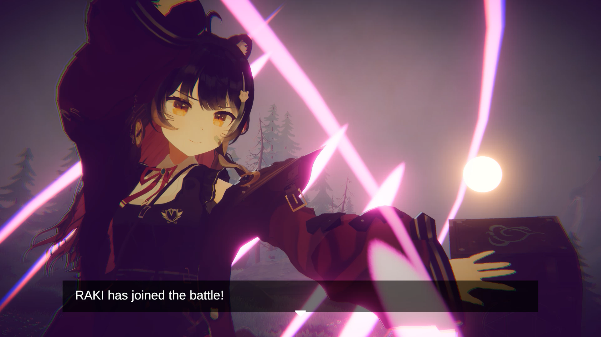
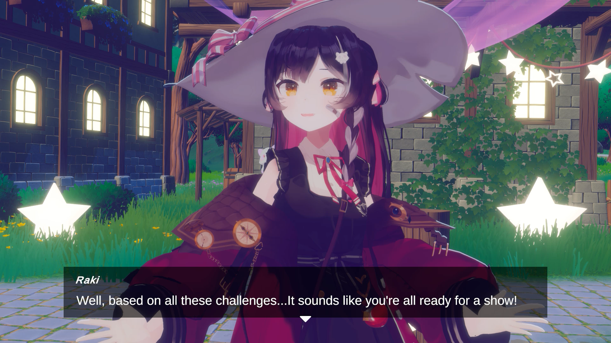

## Description

Composite and render a long-form video suitable for posting on YouTube, streaming, or holding concerts.



### Includes
* Scene visual design
    * Uses mostly pre-made environments
    * Custom environments for additional fees
* Lighting design and setup
* Post-processing
* Camera positioning and camera animations
* Character material adjustments
* Character physics adjustments
* Face animations / Lipsync
* Integrate Unity assets, shaders, components, and scripts

 

### Requirements
* You will need to provide the assets to use
    * 3D model of character (VRM, FBX, UnityPackage)
        * Warudo Character Mods can **NOT** be loaded into Unity Editor
    * Audio
    * Motion Data
* You must ask for a quote and understand that requests may be rejected
* You must pay 50% upfront before work may begin

### Pricing
* Price: ${} per 5 minutes

### Add-ons/Complexity fees
* Additional assets and complexity will incur additional fees

### Details
* Estimated to take 1-2 months
* No work will be performed until first payment
* Videos will be rendered in Unity 6
* Work will be delivered as a video file

## Terms of Service

Feel free to use the commissioned video for commercial and personal uses.
You may also transfer the video to whomever you like.

You are expected to respect the ToS of any assets you are using.

Please contact me via email to request a quote or if you encounter any issues.

Refunds are generally not available once production has started or finished.