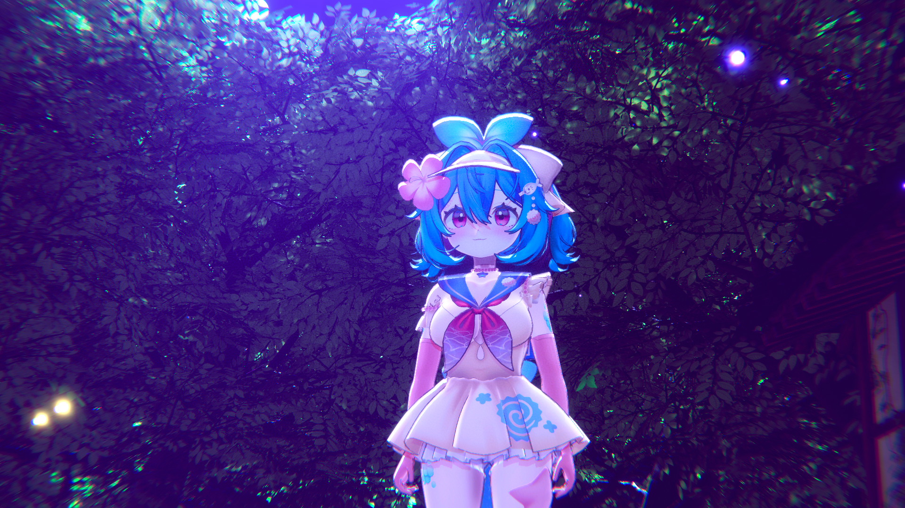
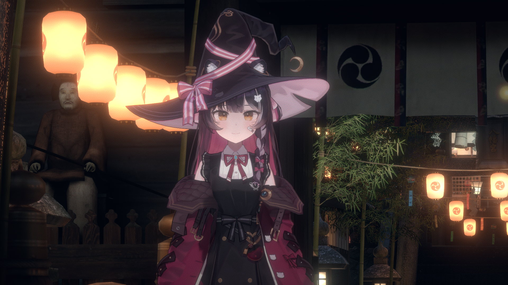
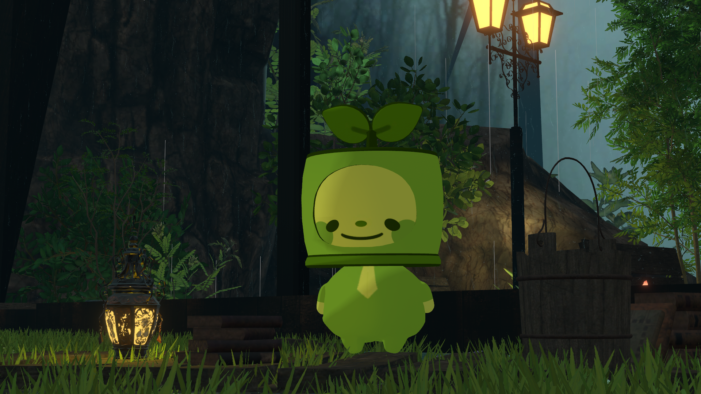
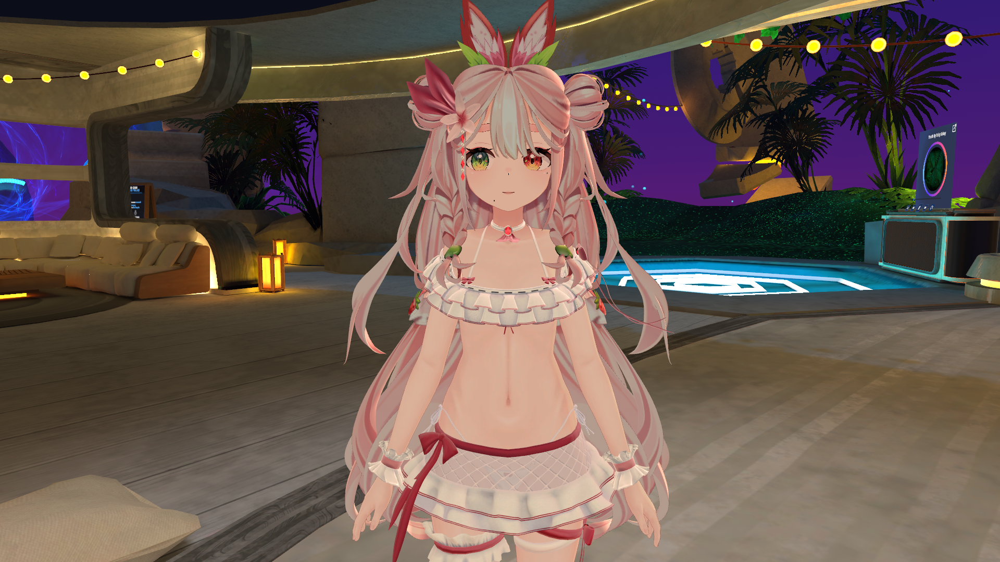
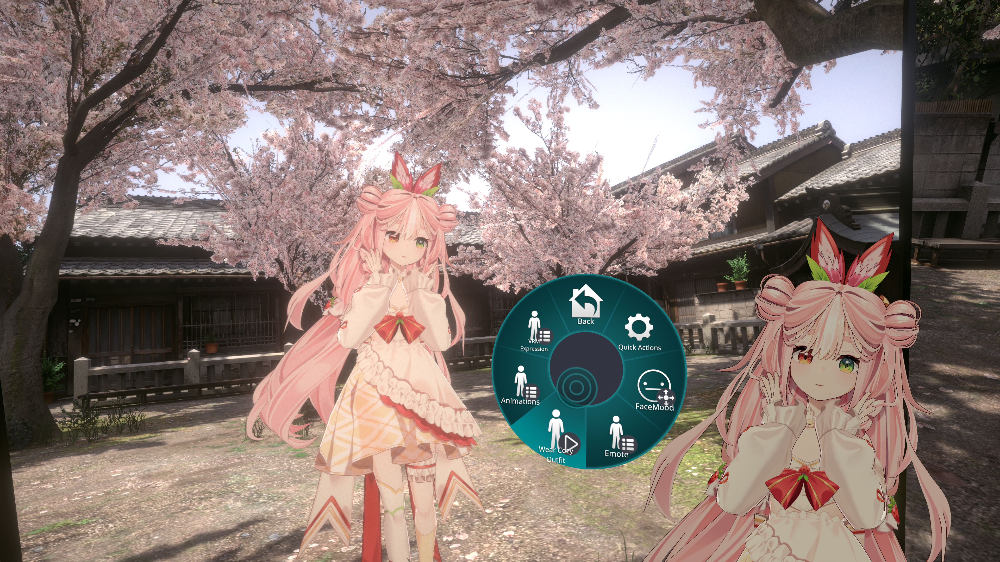
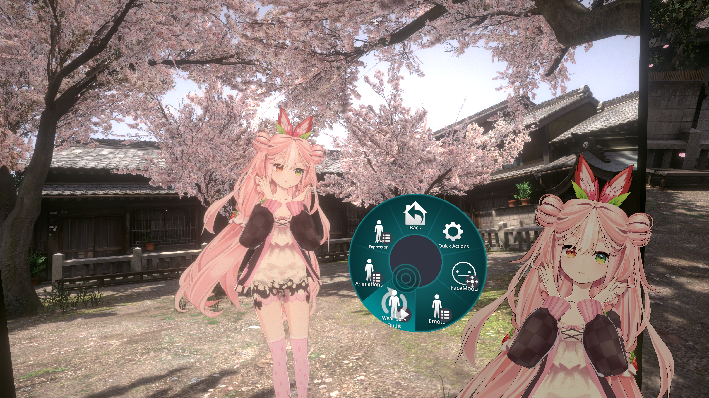

## Description

Convert a VRM model to a VRChat Avatar Prefab.

### Includes
* VRChat Avatar Descriptor
* VRChat Visemes
* Replace VRM physics with VRCPhysBones
* Replace VRM shaders with Unity Shaders (select one)
    * Liltoon BIRP
    * MingToon BIRP (soon)
* Material configuration
* Basic Optimizations
    * Texture Atlasing
    * Mesh and Material Combining
    * Collider simplification
    * Bone simplification
* Basic Toggles
    * Outfit Swaps
    * Blendshape expressions
    * Animation Clips
* Instructions on setting up VCC with dependencies necessary to upload the avatar to VRChat

#### Examples
 

   

#### Outfit Toggles

 

### Important
* While basic optimizations are performed, there is no guarantee that the model will reach any performance rank in particular
* You must have the VRChat SDK installed to upload a VRChat avatar
* You must have a VRChat rank of Visitor or higher to upload an avatar

### Pricing
* Price: ${}

### Requirements

* You must specify what toggles you want
* Please ensure that you are able to upload a VRChat avatar using VCC before requesting a commission
* You must ask for a quote and understand that requests may be rejected
* You must pay 50% upfront before work may begin

### Details
* Estimated to take 1 week
* No work will be performed until first payment
* Delivered as a Unitypackage file
    * It is against ToS for me to log into your account to upload the avatar
    * You will be provided instructions on how to upload the avatar yourself

## Terms of Service

Feel free to use the commissioned avatar for commercial and personal uses.
You may also transfer the assets to whomever you like.

You are expected to respect the ToS of any assets you are using.

I cannot guarantee that VRChat will always be compatible or functional with the provided avatar. Updates will require an additional commission.

I cannot guarantee that the avatar will be completely free of bugs, but I will do my best to fix any bugs you encounter.

Please contact me via email to request a quote or if you encounter any issues.

Refunds are generally not available once production has started or finished.