## Description

Convert a VRM model to a Warudo Character Mod.

Please note that Warudo already supports VRM. This service is for those who prefer specific Unity shaders or physics.

### Includes
* Character Mod creation
* Replace VRM physics with Magica Cloth 2 where applicable
* Physics configuration
* Replace VRM shaders with Unity Shaders (select one)
    * Liltoon BIRP or URP
    * PotaToon URP
    * MingToon BIRP (soon)
* Material configuration
    * Custom shade maps

#### BIRP MToon vs Liltoon Shader Comparison
* Left is MToon, right is Liltoon.
* Featuring Meimi Majokko modeled by @unagi_agi

 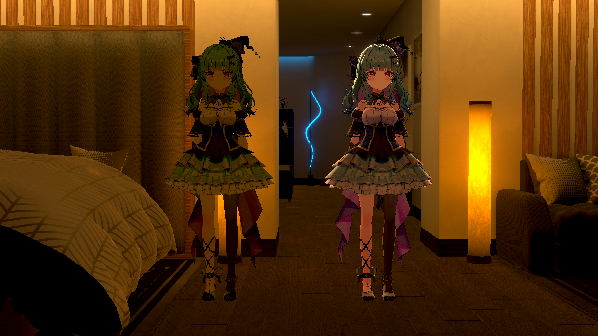 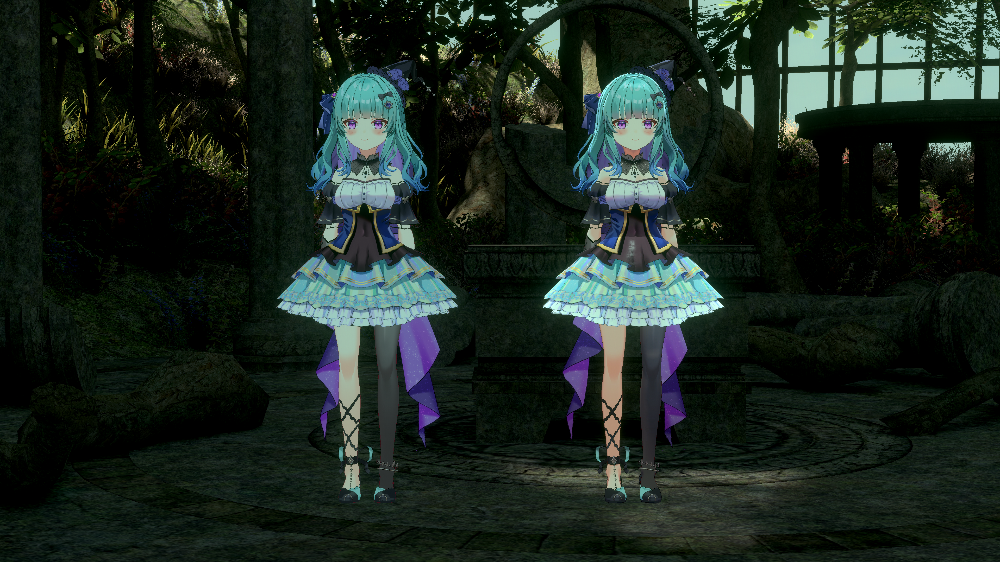 

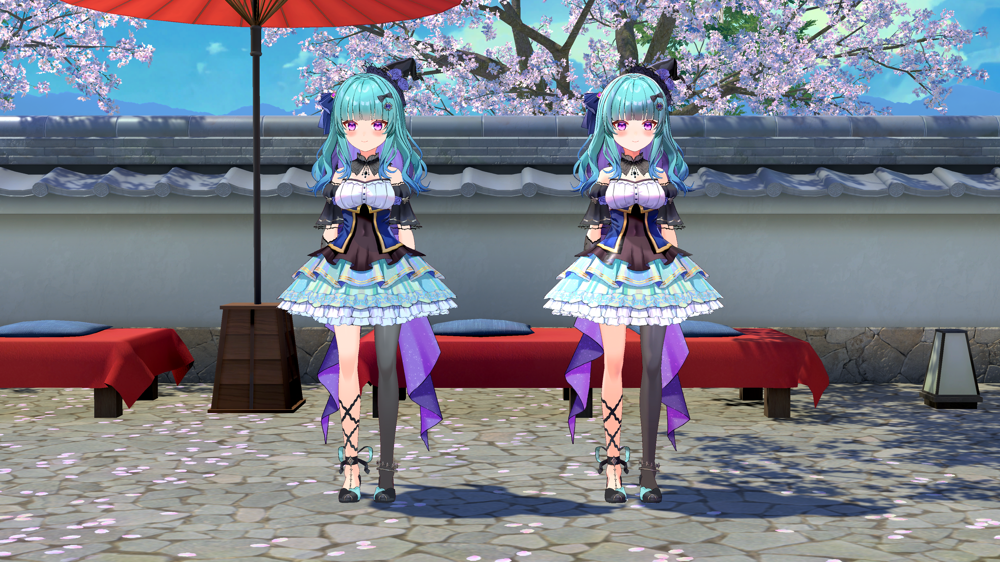 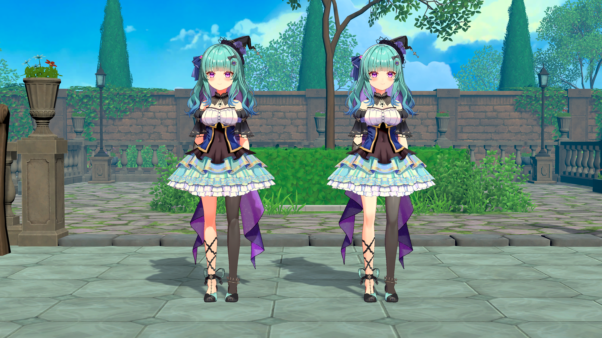 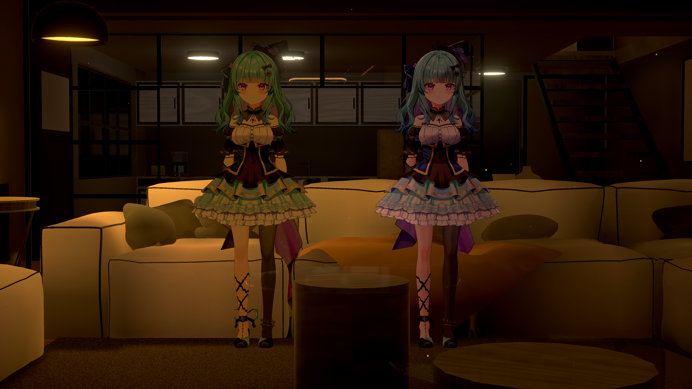 
#### URP MToon vs PotaToon Shader Comparison
* Left is MToon 1.0, right is PotaToon.
* Featuring Raki Kazuki modeled by @pachiko_blender

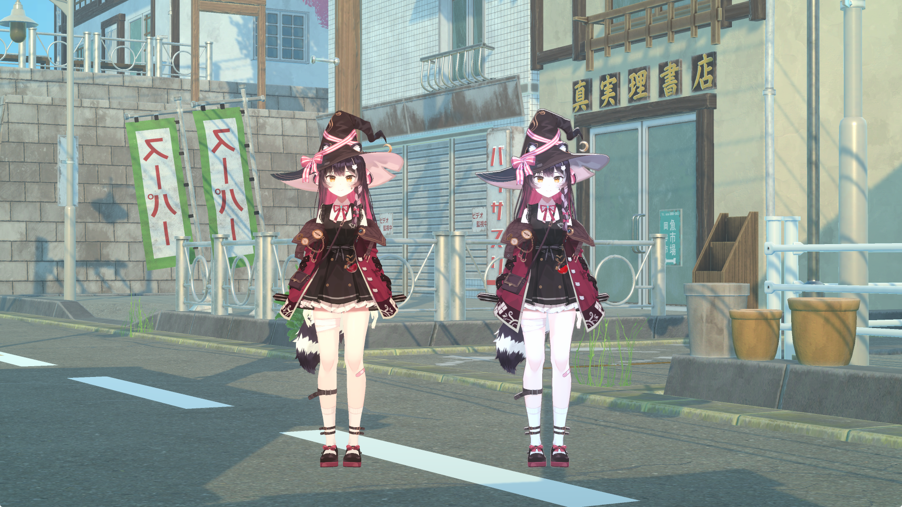 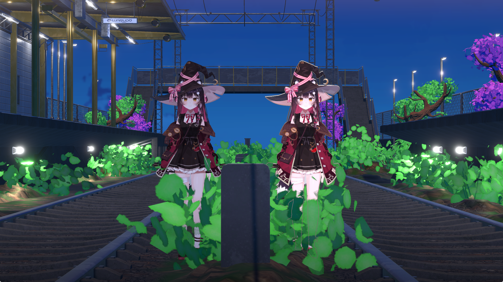 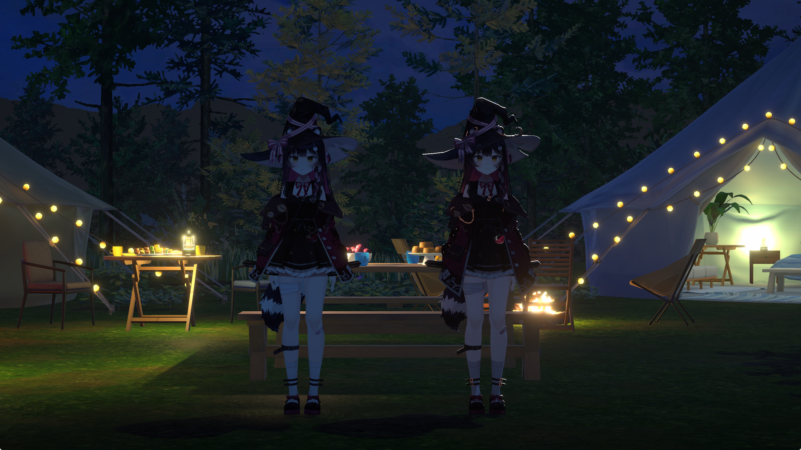 

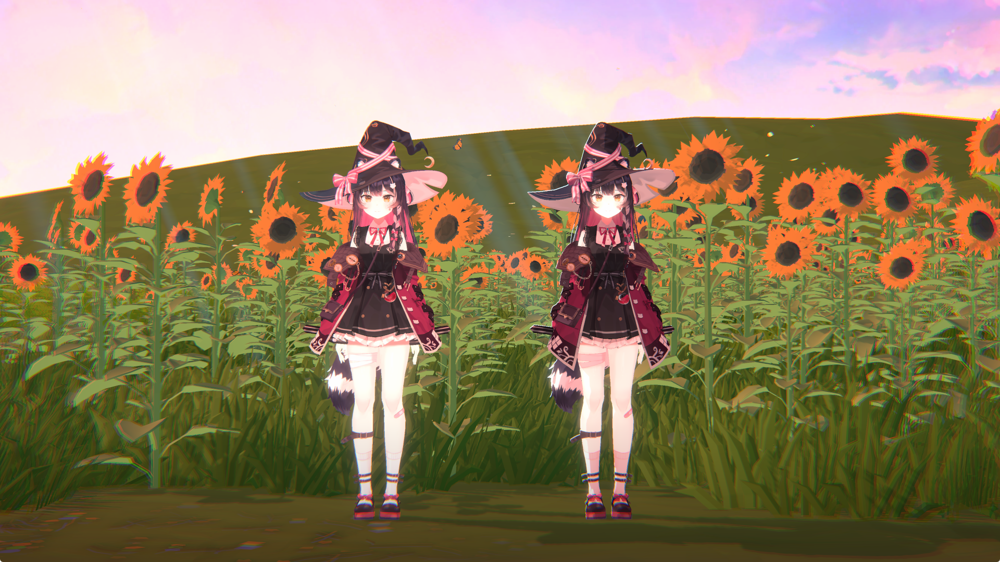 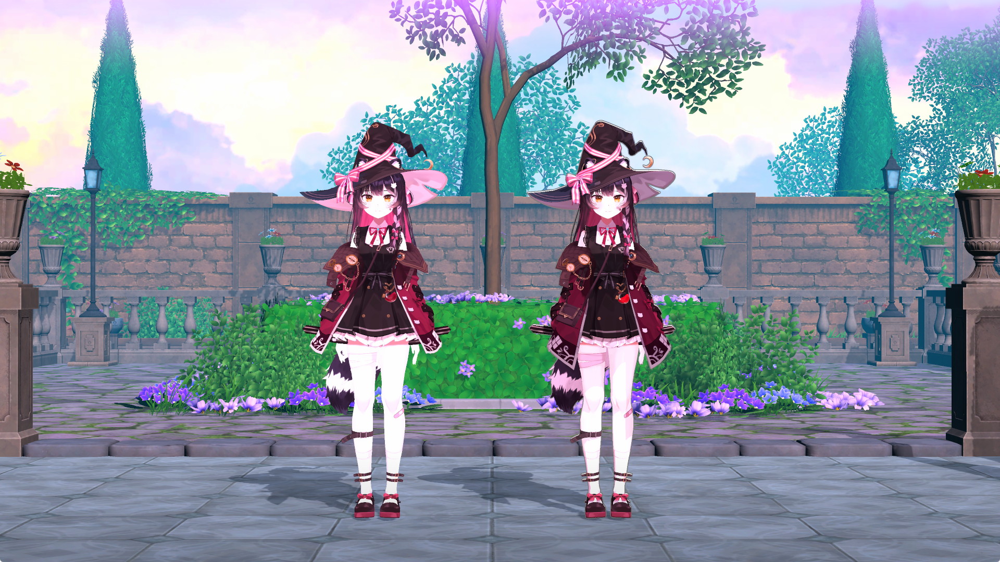 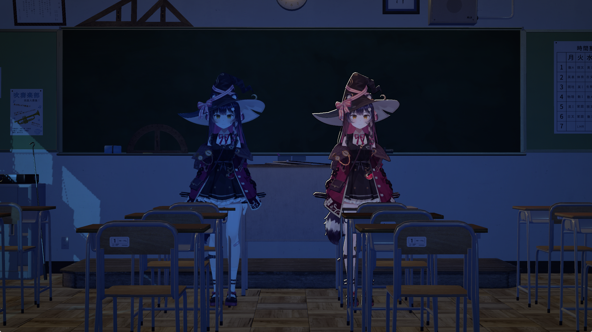 

#### Example VRM vs Magica Cloth 2 and PotaToon in URP



### Important
* This does not include any Warudo scene configuration for the character, such as pendulum physics, keyboard toggles, etc.
* Please note that URP shaders will not work in Warudo without Warudo Pro
* Please note that changes to the model only apply to the final deliverable and will only work in Warudo

### Add-ons/Complexity fees
* If you are using a VRoid model and can provide the .vroid file, I can add ARKit blendshapes for an additional $20 fee (HANA tool)
* If you are using a model with ARKit blendshapes, I can add MMD blendshapes for an additional $20 fee
* I can make basic changes to the model on request for an additional fee

### Pricing
* Price: ${}
* If you require both a BIRP and URP character, this will incur a 50% fee

### Requirements

* You must specify if the character is to be used for Warudo or Warudo Pro
* You must ask for a quote and understand that requests may be rejected
* You must pay 50% upfront before work may begin

### Details
* Estimated to take 1 week
* No work will be performed until first payment
* Delivered as a Warudo Character mod file
    * No VRM file will be provided
* Unitypackage is available on request, but any dependencies cannot be included and must be purchased yourself
* Physics will be tested using generic test animations
    * You may also provide mocap data to test the character physics against
* Shading will be tested against various Warudo Workshop environments using environment lighting and post-processing
    * You may also specify environments or provide a scene to test against

## Terms of Service

Feel free to use the commissioned character for commercial and personal uses.
You may also transfer the assets to whomever you like.

You are expected to respect the ToS of any assets you are using.

I cannot guarantee that Warudo will always be compatible or functional with the provided character. Updates will require an additional commission.

I cannot guarantee that the character will be completely free of bugs, but I will do my best to fix any bugs you encounter.

Please contact me on X to request a quote or if you encounter any issues.

Refunds are generally not available once production has started or finished.