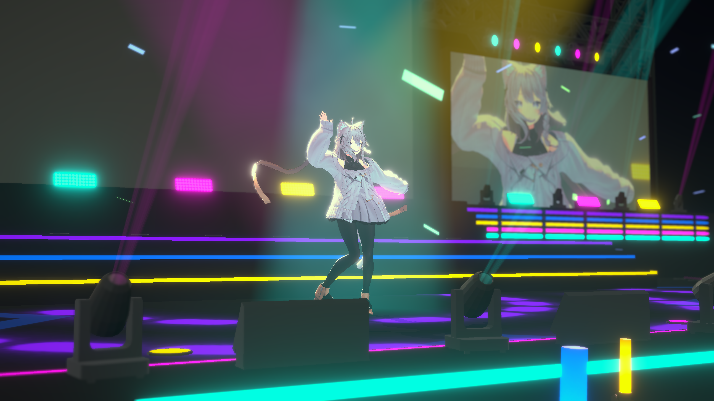
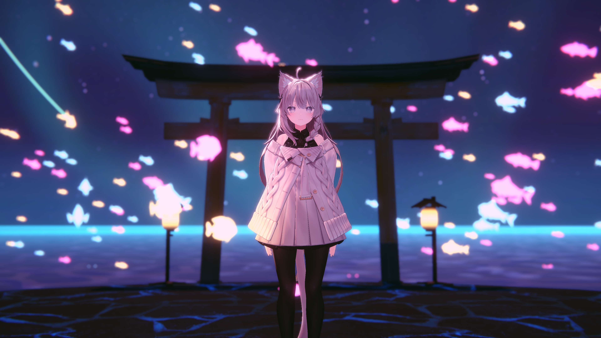

  

## Description

The Warudo scene you always wanted, custom-made just for you! Can be made for your use-case, whether you are streaming live or prerecording a video.

This service assumes that you will bring your own Warudo assets to use, such as characters, environments, and props.
Otherwise you must commission assets or use assets from the Warudo Workshop.

### Includes
* Scene visual design
* Camera positioning and camera animations
    * Warudo Pro Director setup (if applicable)
* Lighting design and setup
* Post-processing
* Character positioning and posing
* Custom blueprints (if applicable)
    * Interactions and chat redeems (if applicable)
    * Audio reactor setup (if applicable)
* Technical support

### Pricing
* Price: ${}
* If the scene is significantly more complex than my previous work, the price quote may be higher

### Important
* Anything that requires the Warudo SDK to build and export will require a separate commission
    * Custom Warudo Environment Mods
    * Custom Warudo Prop Mods
    * Custom Warudo Particle Mods
    * Custom Warudo Plugins or Assets

### Requirements
* You must specify if the Environment is to be used for Warudo or Warudo Pro
* You must ask for a quote and understand that requests may be rejected
* You must pay 50% upfront before work may begin

### Details
* Estimated to take between 1-2 weeks
* No work will be performed until first payment
* Delivered as a Warudo Sceenshare file

## Terms of Service

Feel free to use the commissioned scene for commercial and personal uses.
You may also transfer the assets to whomever you like.

You are expected to respect the ToS of any assets you are using.

Scenes may use assets from the Warudo Workshop which are created and maintained by other users.
I cannot guarantee that these assets will always function as expected.

I cannot guarantee that Warudo or any third-party integrations e.g. YouTube/Twitch will always
be compatible or functional with the provided scene. Updates will require an additional commission.

I cannot guarantee that the scene will be completely free of bugs, but I will do my best to fix any bugs you encounter.

Please contact me via email to request a quote or if you encounter any issues.

Refunds are generally not available once production has started or finished.

